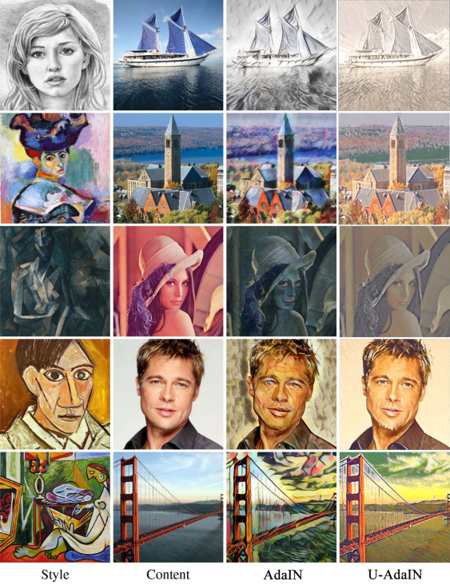
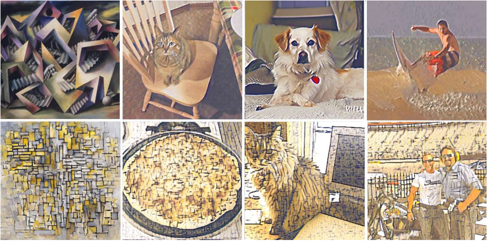

# COGS 181 Final Project

## Overview
This repo is for the final project of COGS 181 WI23. This project proposed ***U**-net-like **AdaIN** (U-AdaIN)*, a possible way to improve AdaIN proposed by Xun and Serge ^[1]^ by replacing the encoder-decoder structure with U-net proposed by Olaf et. al.^[2]^. Although U-net is designed for image segmentation, its auto-encoder-like structure makes it possible for the U-net to perform reconstruction.  

## Requirements
- python >= 3.8
- torch >= 1.13
- torchvision >= 0.14
- pillow
- tqdm
- matplotlib

## AdaIN
AdaIN, or Adaptive Instance Normalization, is a method proposed by Xun and Serge ^[1]^. It takes in a content input $x$ and a style input $y$ and do following computation:
$$
AdaIN(x,y) = \sigma(y)(\frac{x-\mu(x)}{\sigma(x)}) + \mu(y)
$$
Under the hypothesis that the mean and variance carry the style information (the experiments done by Xun and Serge ^[1]^ also prove this in some degree), after applying AdaIN, the style carried by $y$ should be transfered to $x$. 

## Structure
The overall structure is mainly based on the original structure propsed in AdaIN ---- VGG-19 as encoder and the decoder is mostly mirroring the encoder. The difference is that, similar to U-net, upsampling used in original AdaIN structure is replaced by deconvolution. Additionally, skip-connections used in U-net are also adopted. AdaIN is also applied to all skip-connections to preserve style information.

## Training
The loss function is the same as the one used in original AdaIN network. VGG-19 encoder is frozen while training. The network is trained on a desktop with i9-9700K and RTX 2080ti using pytorch 1.12.

## Result

  
   
  <em>Comparison between U-AdaIN and AdaIN</em>

As shown in the image above, it's clear that with the help of skip-connections, U-AdaIN manages to rebuild detail information of images much better than AdaIN. One should note that in all images produced by U-AdaIN do not contain those weird wave-like 
or curve-like patterns which are presented in the output images of AdaIN.  

  
   
  <em>More results of U-AdaIN Note the last column is specially chosen to show suppression of high dimensional feature.</em>

However, speaking of style transfer, U-AdaIN seems to perform worse then AdaIN. This might be caused by low dimensional features suppresing high dimensional features which might happen when the model is trying to decrese content loss (reconstructing the image with low dimensional, by intuition, should be much easier). 

## Reference
[1]: [Arbitrary Style Transfer in Real-time with Adaptive Instance Normalization](https://arxiv.org/abs/1703.06868) 
[2]: [U-Net: Convolutional Networks for Biomedical Image Segmentation](https://arxiv.org/abs/1505.04597)